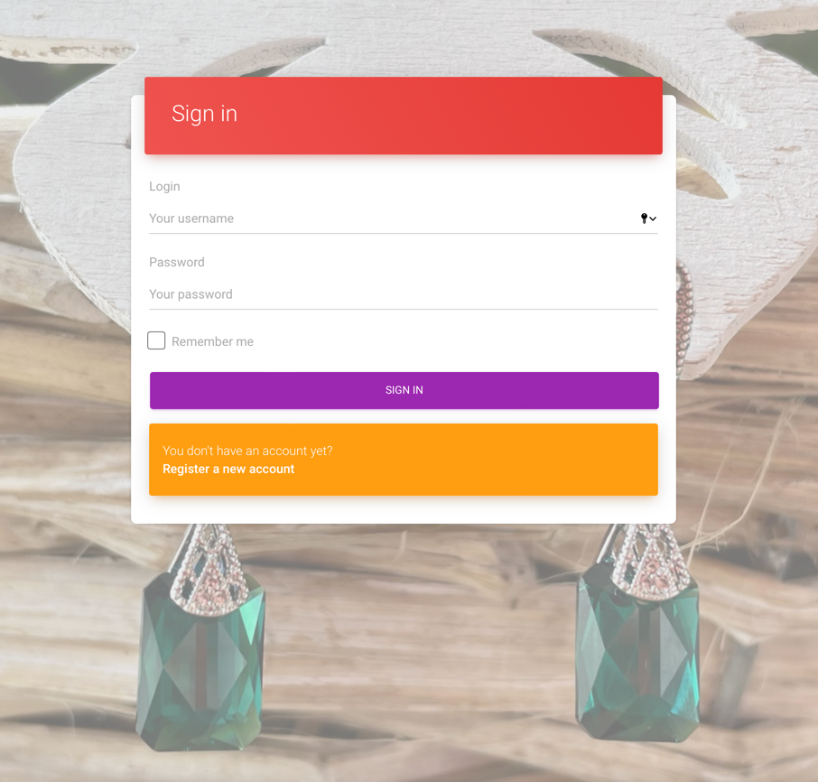

# Dama UI

<h3>Using this User Interface, the client can create/read/update/delete new earring components and the earrings. The UI works with [Dama Api Service](https://github.com/R-0-m-a/dama_api_service#readme).
</h3>

## Technology Stack

| Technology                                                                     | Description                                                                                                                                                  |
|--------------------------------------------------------------------------------|--------------------------------------------------------------------------------------------------------------------------------------------------------------|
| [Angular 12](https://angular.io)                                               | free and open-source web application framework, based on a TypeScript                                                                                        |
| [Angular Material 12](https://material.angular.io)                             | User Interface (UI) component library that developers can use in their Angular projects to speed up the development of elegant and consistent user interfaces |
| [Bootstrap 4](https://getbootstrap.com/docs/4.6/getting-started/introduction/) | free and open-source CSS framework|
| [jquery](https://jquery.com)                                                   | fast, small, and feature-rich JavaScript library                                                                                                                                                             |
| [Firebase](https://firebase.google.com)                                        | Cloud Storage for Firebase is built for app developers who need to store and serve user-generated content, such as photos or videos.                                                                                                                                                        |
| [git](https://git-scm.com/ )  | Free and Open-Source distributed version control system                                                                                                         |
| [Docker](https://www.docker.com/) | A set of platform as a service products that use OS-level virtualization to deliver software in packages called containers.                                     |


## Development

Before you can build this project, you must install and configure the following dependencies on your machine:

[Node.js](https://nodejs.org/en/): We use Node to run a development web server and build the project.
Depending on your system, you can install Node either from source or as a pre-packaged bundle.

After installing Node, you should be able to run the following command to install development tools.
You will only need to run this command when dependencies change in [package.json](package.json).

```
npm install
```

We need to specify our Environment variables for the application.

~~~txt
|------------------------------|
|   Configuration FIREBASE     |
|------------------------------|
| FIREBASE_API_KEY             |
| FIREBASE_DATABASE_URL        |                                                                             
| FIREBASE_AUTH_DOMAIN         |
| FIREBASE_PROJECT_ID          |
| FIREBASE_STORAGE_BUCKET      |
| FIREBASE_MESSAGING_SENDER_ID |
| FIREBASE_APP_ID              |
| FIREBASE_MEASUREMENT_ID      |
|------------------------------|
~~~

Run `npm run start` for a dev server. Navigate to `http://localhost:4200/`. The app will automatically reload if you change any of the source files.



## Building

Run `npm run build --prod` to build the project. The build artifacts will be stored in the `dist/` directory.

### Using Docker to simplify development

Building docker image. In order to populate our environment variables for the application, we must set relevant arguments:

```
docker build \
-t dama-ui:latest\
--build-arg FB_API_KEY=enter here the current data \
--build-arg FB_DATABASE_URL=enter here the current data \
--build-arg FB_AUTH_DOMAIN=enter here the current data \
--build-arg FB_PROJECT_ID=enter here the current data \
--build-arg FB_STORAGE_BUCKET=enter here the current data \
--build-arg FB_MESSAGING_SENDER_ID=enter here the current data \
--build-arg FB_APP_ID=enter here the current data \
--build-arg FB_MEASUREMENT_ID=enter here the current data .
```
Push a new image to a registry, run:
```
docker tag dama-ui registry-host/dama-ui
docker push registry-host/dama-ui
```

Example using a new image in docker-compose.yml:
```
  dama-ui:
    image: registry-host/dama-ui
    ports:
      - 8082:80
    
```


